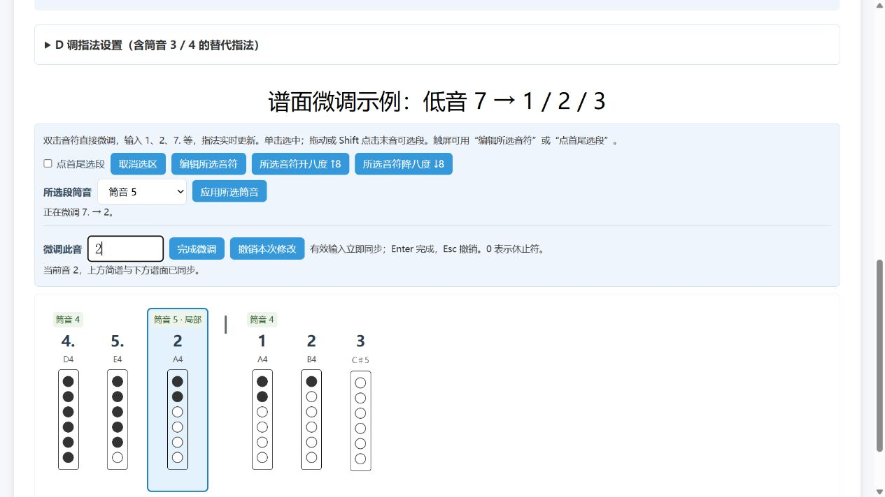

# Tin Whistle Tab Maker

**哨笛简谱与指法编辑器** · [English](README.en.md)

把数字简谱转换成可打印的六孔哨笛指法谱，并直接在谱面上修改音符、调整选段八度和设置分段筒音。支持 D 调半音、带来源说明的叉指预设，以及可保存的个人指法。

纯 HTML、CSS、JavaScript；无需安装、注册或构建。下载后打开 `index.html` 即可使用。

[下载源码 ZIP](https://github.com/liyouyi0307-hub/tin-whistle-tab-maker/archive/refs/heads/main.zip) · [详细使用说明](D调半音更新说明.md) · [指法资料核验](叉指资料核验.md)



## 来源与作者

本项目基于 **[TwinkleLee / tin-whistle-sheet-generator](https://gitee.com/twinklelee/tin-whistle-sheet-generator)** 继续开发，由 **[liyouyi0307-hub](https://github.com/liyouyi0307-hub)** 维护。感谢 TwinkleLee 提供原始生成器。

原作提供了简谱转指法图、基础调性映射、打印和曲谱保存等功能。本版本主要增强 D 调半音、个人指法配置以及谱面编辑流程。上游 README 声明使用 MIT License，本项目沿用 MIT，并分别标注原作与后续修改的版权。

基础提交、原版说明和具体改进见 [UPSTREAM.md](UPSTREAM.md)；原版中英文 README 保留在 [docs/upstream/](docs/upstream/)。

## 功能

| 功能 | 说明 |
| --- | --- |
| 简谱转指法谱 | 六孔图、音符标记、打印样式，以及格式错误和越界音提示 |
| D 调半音 | 支持升降号、还原号、半孔，按实际音高与八度生成指法 |
| 个人指法 | 20 种分八度叉指预设，附来源和试音说明；支持自定义六孔组合与预览后应用 |
| 整谱与局部八度 | 调整全部音符，或只调整输入框 / 谱面中的选段，保留原有节奏符号与排版 |
| 分段筒音 | D 调支持筒音 1 / 3 / 4 / 5；同一谱面可以混用多种筒音，切换处显示标记 |
| 单音微调 | 双击谱面音符或按 F2 修改；有效输入立即同步简谱与指法，支持撤销本次微调 |
| 保存与恢复 | 导入 / 导出 JSON，保存个人指法与局部筒音；浏览器刷新可恢复，无效导入保护现有曲谱 |

## 快速开始

1. 下载上面的源码 ZIP 并解压，双击 `index.html`，或通过普通静态网页服务器打开。
2. 选择哨笛调性和整谱筒音，在输入框中输入简谱，点击“生成笛谱”。
3. 点击音符、拖动选段或 Shift+点击末音；触屏也可使用“点首尾选段”。
4. 在谱面工具栏修改所选段的筒音或八度；双击单音可直接微调。
5. 点击“保存笛谱”导出 JSON，之后通过“读取笛谱”继续编辑；需要纸质谱时使用打印功能。

建议定期导出 JSON。浏览器本地保存不能代替备份，清理浏览器数据或换设备时不会自动迁移。

## 简谱输入示例

D 调、筒音 1 的自然音阶：

```text
1 2 3 4 5 6 7 1'
```

D 调、筒音 1 的半音练习：

```text
1 #1 2 b3 3 4 #4 5 #5 6 b7 7 1'
```

| 写法 | 含义 |
| --- | --- |
| `#1` / `♯1` | 相对当前简谱音阶升半音 |
| `b3` / `♭3` | 相对当前简谱音阶降半音 |
| `n3` / `♮3` | 回到当前简谱音阶的第 3 音；D 调筒音 1 下仍为 F♯ |
| `1'` / `1.` | 高八度 / 低八度 |
| `3·` | 附点音符 |
| `0` / `2---` | 休止符 / 延长线 |
| `|` | 小节分隔 |

升降号只作用于紧随其后的一个音。分段筒音保留简谱数字，按所选模式重新计算实际音高与指法；不会改变哨笛本身的物理调性。

可读取 [MixedTubeModes.json](MixedTubeModes.json) 查看同谱三段筒音示例。[KingdomDance.json](KingdomDance.json) 是上游提供的示例曲谱。

## 指法与适用范围

半音扩展针对普通六孔 D 调哨笛；C、G、F 调保留原版映射。筒音 3 / 4 的最低简谱分别为 `3.` / `4.`，同一支 D 调哨笛的最低实际音仍是 D。

20 种叉指预设覆盖 7 / 10 个半音及八度组合；两个八度 E♭ 和低八度 F 仍采用半孔。预设来自指法资料和特定笛型 / 演奏者经验，不同哨笛可能需要调整半孔开度或气息。本项目尚未进行实际哨笛试吹验证。

目前主要用于简谱与指法编辑，不包含音频播放或 ABC、MusicXML、MIDI 导入。完整操作和核验边界见 [D调半音更新说明.md](D调半音更新说明.md)。

## 开发与检查

网页本身不需要依赖或构建工具。运行现有自动检查需要 Node.js：

```sh
node --test tests/chromatic.test.cjs
```

40 项检查覆盖音高与指法映射、升降八度、选段、单音编辑、局部筒音、JSON / 浏览器恢复和无效输入保护。自动检查不代替真实设备体验或哨笛试吹。

欢迎通过 [Issues](https://github.com/liyouyi0307-hub/tin-whistle-tab-maker/issues) 反馈问题。请附简谱输入、哨笛调性、筒音、操作步骤和预期结果；新增指法建议应注明笛型、八度与资料来源。

## 文件结构

```text
index.html                  主程序
MixedTubeModes.json         混合筒音练习示例
KingdomDance.json            上游示例曲谱
tests/chromatic.test.cjs     自动检查
docs/images/note-edit.jpg    界面示例
docs/upstream/               原版中英文 README
D调半音更新说明.md            详细操作与验证记录
叉指资料核验.md               指法依据与适用限制
UPSTREAM.md                 上游来源与改进清单
DESCRIPTION.md              中英文项目简介
LICENSE                     MIT 许可证
```

## 许可证

软件采用 [MIT License](LICENSE)，保留原作与后续修改的版权声明。引用资料、曲谱及所链接网站的内容可能有独立的权利归属，软件许可证不代替这些内容的授权。`tmp/` 与 `output/` 为本地研究、预览和打包目录，不随源码仓库发布。
